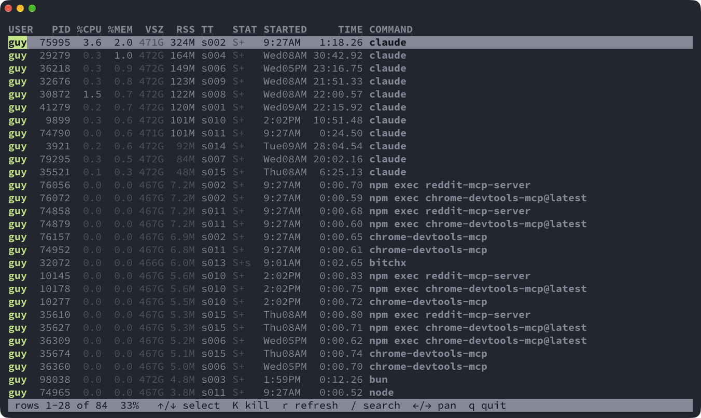

# pss

A readable `ps` for macOS, in Rust. It takes the same options as `ps`, but lines
up its columns, shows sizes as `1.2G`, colors the output, and opens an
interactive view when the list is taller than your screen.



## Usage

```
pss [BSD-OPTIONS] [-options] [--long-options] [PATTERN...]
```

- With no options it lists your processes that have a terminal.
- `pss aux`, `pss -ef`, `pss -o pid,comm` and the rest work as they do in `ps`.
- `pss PATTERN` matches command lines (lowercase ignores case) and highlights the match.
- `-r` / `-m` sort by CPU / memory; `--sort -%cpu,pid` sorts by any keyword.
- `-i` always opens the interactive view; `-P` never does.

Run `pss --help` for everything.

## Interactive view

| Key | Does |
|---|---|
| `j`/`k`, `↑`/`↓` | select |
| `space`/`b`, `g`/`G` | page, top/bottom |
| `←`/`→` | pan |
| `K` | kill the selected process (`y` = TERM, `9` = KILL); the row turns red while it asks, then faded and struck through until the process exits and drops off the list |
| `/`, `n`/`N` | search, next/previous match |
| `r` | refresh now (the list also refreshes itself every 2s) |
| `q` | quit |

## Install

```sh
cargo install --path .
```
